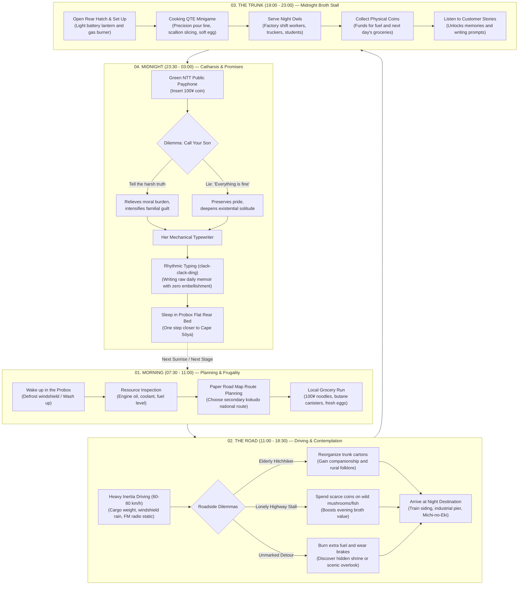

# OBSOLETO (Working Title)
### Game Design Document (GDD) — Version 1.0
> *"You are 47 years old, driving an old station wagon with instant noodle cups in the trunk, your late wife's ashes on the passenger seat, and her unfinished novel in an analog typewriter."*

---

## 1. Executive Summary & High Concept

* **Title:** OBSOLETO (*時代遅れ* / *Laid Off* / *Midnight Noodle*)
* **Genre:** Slice-of-Life / Narrative Survival / Contemplative Driving / Cooking Micro-Management
* **Target Platforms:** PC (Steam / itch.io), Steam Deck verified, future console adaptations.
* **Target Audience:** Players of *Pacific Drive*, *Coffee Talk*, *Jalopy*, *Cart Life*, *A Short Hike*, *Euro Truck Simulator*.
* **Recommended Engine:** Godot Engine 4.x or Unity (Lightweight URP).
* **Visual Style:** Low-poly retro stylized (PS1 / 32-bit era inspiration), untextured or flat palettes with dithering, prioritizing atmospheric volumetric lighting, rain shaders, fog, and headlight reflections on wet asphalt.
* **Monetization:** Premium single purchase ($10 - $15 USD), zero microtransactions or invasive DLC.

### Elevator Pitch
Set in **contemporary Japan**, you play as Kenji (47), an administrative clerk dismissed during a corporate restructuring after 25 years of faithful service — replaced by a fresh graduate earning a third of his salary through automated digital workflows. Evicted from his Tokyo apartment and refusing to burden his adult children, Kenji sells his smartphone to buy basic rations and packs what little remains into his modest **1998 Toyota Probox**: the quintessential, unglamorous workhorse of the Japanese salaryman.

In the back, he carries a crumpled notebook containing his son’s landline number, an old 35mm film camera (bought 15 years ago for a family road trip that work kept delaying), a paper road map bought at a gas station, and **his late wife's portable mechanical typewriter** — a woman who dreamed her whole life of being a novelist before cancer took her.

With her ashes in a ceramic urn and her portrait taped to the dashboard, Kenji finds a quiet, fierce resolve: he will fulfill his unkept promises by driving all the way to Japan's northernmost tip (**Cape Sōya**). To afford gasoline and maintenance without digital money, he pops the trunk at dusk selling "tuned" instant ramen to nocturnal shift workers and truckers; from green NTT public payphones, he confronts the dilemma of confessing his ruin to his son or smiling through tears to say *"Everything is fine"*; and each midnight, he types on her machine to finish the book she never got to write.

---

## 2. Narrative Synopsis & Character Arc

### The Contemporary Reality: 25 Years of Invisible Routine
* **The Protagonist:** Kenji (47 years old). Loyal, quiet, punctual. For a quarter of a century, he was an invisible administrative cog.
* **The Salaryman's Real Vehicle:** A white **1998 Toyota Probox** (or *Corolla Fielder* 1.5L) with unpainted grey plastic bumpers and scuffed hubcaps. In Japan, the Probox is the national icon of corporate sacrifice: compact (4.2 meters long), indestructible, cheap to fuel, with rear seats that fold completely flat (engineered for file boxes or 20-minute power naps). It fits seamlessly into narrow rural alleys where Western vans cannot tread. It smells of canned green tea, aged A/C, and archived paperwork.
* **The Verdict of the Digital Age:** *«You know it in your gut: a fresh graduate costs a third of your salary, navigates automated tools with ease, and doesn't have tired eyes. To modern corporate algorithms, you are simply obsolete operational overhead.»*
* **Forced Isolation:** Unable to afford Tokyo rent and refusing to burden his adult children (who struggle with their own mortgages and debts), Kenji hands over the apartment keys. He **pawns his smartphone** to buy final cartons of instant noodles, gas canisters, and water jugs. In his pocket remains only a wrinkled paper notebook with his son's landline number.

### Packing the Car: The Four Anchors of Memory
1. **The Ceramic Urn & Framed Portrait:** Wrapped in silk on the front passenger seat; her black-and-white portrait taped beside the dashboard air vents.
2. **The Folded Paper Road Map:** Picked up at a highway service area. With no GPS or cellular data, this paper map folded across the steering wheel is his only compass across national secondary routes (*kokudō*).
3. **The 35mm Film Camera (24 Exposures Remaining):** Bought 15 years ago with his wife as «the first step for our big holiday road trip» that was postponed year after year until her hospital stay. Exactly 24 frames remain.
4. **Her Mechanical Typewriter:** The sacred artifact. She spent decades scribbling story outlines and poems in notebooks. He always promised her: *«Once the debts are cleared, I will give you the time to write your novel»*. A promise broken by 25 years of unpaid overtime.

### The Green NTT Payphone Dilemma
At road stations (*Michi-no-Eki*) and village crossroads, green NTT public coin payphones hum quietly in the night. Inserting a 100-yen coin earned from selling noodles, Kenji dials his son’s number:
* Does he confess the truth? (*«Son... I lost my job, lost the apartment, and I'm living out of the car»*).
* Or does he choke back his tears against the receiver static to say: *«Everything is going great here, son. Just wanted to hear your voice. Take care of yourself»*?

### The Core Resolution: Fulfilling the Vow
Pain turns into quiet steel:
> *«If I am obsolete to the corporate world, if I don't owe another second to any executive... now I will fulfill what I promised you. I will take you to Cape Sōya. I will take the photos we never took. And on your typewriter, I will finish the novel I never gave you time to write.»*

---

## 2.1 Author's Manifesto & Genesis: Silent Battles and Hot Broth

> *«Not all battles are fought with assault rifles or in bloody wars. Most of us fight invisible battles every single day: against the cold, against routine, and against the terror of being discarded.»*

The inspiration for **OBSOLETO** didn't come from a boardroom meeting analyzing Steam retention curves. It came from real-life experiences, forgotten accounts, countless videos documenting quiet daily life on the fringes of Japan, and my own dreams. From watching time slip away relentlessly, watching dreams come and go, and realizing that to modern corporations, humans are often treated as nothing more than replaceable lever-pullers.

As an AI Architect, I face the paradox of our era every day: a colossal technological capability too often abused out of laziness to flood the world with hollow stories, soulless games, and flat characters devoid of human tropes or genuine pain. We live in a quiet generational clash: the young who look down on the old, convinced nothing before them held any value; and the old who refuse to adapt, convinced every novelty is a disaster. Yet beneath all that noise lies a latent terror that touches everyone: **the fear that your time will run out, and the world will declare you obsolete**.

This is a reality millions already endure: an ache of nostalgia, broken promises, and an endless story that never pauses. No matter how much you endure today, tomorrow you will have to endure a little more, regardless of the freezing rain, hunger, or bone-deep exhaustion.

Every day, we are all fighting for the same thing—survival and purpose—but some people carry far heavier battles. And those battles aren't fought with gunpowder: they are fought silently in the front seat of a beat-up car on a frozen roadside. And sometimes, in the middle of that storm, **a simple bowl of hot broth is all a human being needs to smile, catch their breath, and keep going for one more kilometer.**

This game is not designed for genre purists; it is for the honest ones. For those who know the weight of unreciprocated loyalty, the quiet sting of a phone call you were too proud to make, and the solace of modest warmth at the end of an exhausting shift.

---

## 3. Core Pillars of Game Design

```
       ┌────────────────────────────────────────────────────────┐
       │                   OBSOLETO: PILLARS                    │
       └────────────────────────────────────────────────────────┘
            │                       │                      │
 ┌──────────────────────┐ ┌───────────────────┐ ┌────────────────────┐
 │  Dignity of Routine  │ │  Tripartite Loop  │ │ Pure Diegesis      │
 │  Victory is full gas │ │  The Road ➔       │ │ UI integrated into │
 │  and 30m of peace.   │ │  The Trunk ➔      │ │ vehicle, tools and │
 │                      │ │  The Typewriter   │ │ physical objects.  │
 └──────────────────────┘ └───────────────────┘ └────────────────────┘
```

1. **The Dignity of Routine (Humanist Survival):** Victory is not becoming a fast-food franchise tycoon. It’s earning enough coins for 15 liters of regular gasoline, replacing a fouled spark plug, buying a fresh egg, and having 30 quiet midnight minutes to write.
2. **The Tripartite Pacing Loop:**
   * *The Road:* Meditative, physical inertia, rain on windshield, cassette deck and FM static.
   * *The Trunk (Stall):* Fast-paced, tactile, boiling steam, QTE precision, micro-stories from night owls.
   * *The Night:* Intimate, rhythmic, diegetic typewriter soundscapes (*clack-clack-ding*) and emotional closure.
3. **Pure Diegesis:** Zero floating mini-maps or digital HUD clutter. Fuel is read on the analog needle; engine health in radiator hiss; money counted in cup holder coins; route navigation on a real paper map.

---

## 4. The Daily 24-Hour Loop

Each cycle represents a continuous 24-hour journey divided into 4 interconnected phases:



| Phase | In-Game Clock | Active Mechanics | Emotional Tone |
|---|---|---|---|
| **Morning** | 07:30 – 11:00 | Defrost windshield, review paper map, inspect oil/tire pressure, buy groceries at local stalls. | Quiet caution, frugal planning. |
| **The Road** | 11:00 – 18:30 | Heavy inertia driving (60–80 km/h), radiator temperature control, FM radio, scenic contemplation. | Zen focus, bittersweet relief. |
| **The Trunk** | 19:00 – 23:00 | Rapid ramen preparation, noodle timing, scallion cutting, earning coins, listening to stories. | Tactile urgency, human connection. |
| **Midnight** | 23:30 – 03:00 | Typewriter rhythm minigame, battery lantern, payphone calls to son, rest to recover stamina. | Warm melancholy, quiet catharsis. |

---

## 5. Detailed Systems & Mechanics

### 5.1 Vehicle Physics, Cockpit & Roadside Choices (Toyota Probox)
* **Inertia & Weight:** Realistic weight distribution. The car struggles uphill when carrying extra noodle cartons and luggage; light tail sliding on wet mountain passes.
* **Radiator & Temperature:** Steep mountain passes overheat the coolant. Ignoring the rising analog temperature needle causes white steam to billow from the hood, demanding emergency stops.
* **Windshield Wipers:** Realistic wiper sweep with worn rubber leaves streaks in heavy downpours until replaced.
* **Cassette & FM Tuner:** Manual knob tuning across 3 regional frequencies with mountain static; finding discarded cassette tapes featuring ambient lo-fi, acoustic folk, and jazz.
* **Roadside Dilemmas & Spontaneous Curiosity:**
  * *Will you give a ride to that elderly man walking alone along the shoulder in the drizzle?* You gain his warm company and lost memories of rural Japan, but you must shift your trunk boxes onto the floor to make room.
  * *Will you stop to buy from that lonely highway stall selling wild mushrooms or dried fish?* Spending your few precious coins might jeopardize tomorrow's fuel money, but it transforms your broth into an unforgettable meal.
  * *Will you stick to your road map plan, or turn down the unmarked exit that says "Village X: 200m" out of sheer curiosity to see what lies behind that mountain?* Detours stress your brakes and fuel gauge, but reward you with the most poignant viewpoints and grateful night travelers.

### 5.2 The Trunk Noodle Stall
* **Boiling Water QTE:** Hold down the trigger to pour boiling water from the kettle to the exact inner fill line.
* **Rhythmic Topping:** Chop scallions on a small cutting board over the bumper edge with a folding knife.
* **Soft-Poached Egg:** Crack a raw egg at the optimal resting moment so residual broth heat cooks the yolk into silky richness.
* **Customer Archetypes:**
  * *Night Factory Laborers:* Crave salty, piping-hot broth; leave coins quickly.
  * *Long-Haul Truckers:* Share highway warnings about roadblocks or mountain landslides.
  * *Troubled Youths & Students:* Eat quietly, opening up about their fears and unlocking writing topics.
  * *Elderly Villagers:* Barter fresh garden leeks or eggs in exchange for hot soup and company.

### 5.3 The Typewriter Station (Writing the Unadorned Truth)
In the rear cabin, illuminated by a battery lantern, Kenji sits before his late wife's portable typewriter and her old notebooks.
* **No Fiction, Only the Raw Truth:** Kenji is not a novelist; he doesn't know how to craft ornate fiction or clever prose. He is just an ordinary man recounting his day-to-day: the morning chill on the steering wheel, the crunch of gravel under worn tires, the three coins dropped into his cup holder, the ache in his shoulders, and the cold silence after hanging up the payphone. **He writes without embellishment.** Since his wife is no longer here to write her book, he will fulfill her dream with the only truth he has: the living memoir of this journey.
* **Rhythmic Typing Minigame:** Memories and impressions appear as rhythmic prompts. Pressing keys to tempo produces satisfying lead-type hammer strikes (*clack-clack-clack*).
* **Carriage Return:** Reaching line margins triggers the mechanical chime (*ding!*), requiring an `[Enter]` carriage return (*shhh-clack*).
* **Physical Jamming:** Missing beats causes mechanical typebars to collide and tangle; the player must manually untangle them with mouse or analog stick.
* **Submissions:** Completed chapters can be posted via village post boxes to regional literary journals under her name.

### 5.4 Space Management (Probox Trunk Tetris)
* Flat-folding rear floor grid inventory.
* Permanent items: wife's urn and portrait (front passenger seat), sleeping bag, typewriter case.
* Finite space forces tradeoffs: carrying a hitchhiker or fresh produce boxes means rearranging fuel canisters or sleeping cramped.

### 5.5 Green Payphones & 35mm Camera
* **Green NTT Payphone:** Spending 100-yen coins to call his son’s landline with branching dialogue: confessing the truth vs. maintaining the protective lie.
* **35mm Camera (24 Exposures):** Limited shots across the entire campaign. Photographs taken by the player are revealed during the final credits sequence at Cape Sōya.

---

## 6. World Structure: Node Graph & Modular Biomes

Instead of an unfeasible open world, the game utilizes a **Node Graph with Modular 3D Biome Generation**:
* **Regions:** South Coastal Ports ➔ Central Industrial Valley ➔ Misty Mountain Pass ➔ Hokkaido Coastal Highway ➔ Cape Sōya.
* **Modular Assembly:** 20 handcrafted highway modules (bridges, tunnels, curves, roadside stalls) procedurally linked based on segment attributes (e.g., 60% forest, 40% rain).

---

## 7. Game Modes & The Cape Sōya Ending

* **The Pilgrimage (Main Campaign - 6 to 8 hours):** The complete emotional journey from Tokyo to Cape Sōya.
* **Short Road (Story Mode - 2 hours):** Self-contained two-region run for single-sitting sessions.
* **Endless Zen Mode:** Continuous procedural roads unlocked post-campaign.

### The Climax at Cape Sōya: Fulfilling the Vow
Where the asphalt ends before the gray, frozen northern sea, Kenji turns off the engine.
He sets up the burner on the hood, pours two steaming noodle cups — one for himself, one placed reverently beside her urn.
Inside the car, by lantern light, he types the final chapter of her book on her machine: a tapestry woven from the ordinary lives met along the road.
At sunrise, he scatters her ashes into the waves. He has kept both promises.

---

## 8. Technical Feasibility & Scope Control

| Typical Development Pitfall | Pragmatic Solution in OBSOLETO |
|---|---|
| Handcrafting hundreds of km in 3D | **2D Node Graph + 20 Modular 3D Road Segments** |
| Expensive voice acting & mocap | **Diegetic text dialogues, rich foley sound, environmental storytelling** |
| High-poly character meshes | **Stylized low-poly models + illustrated 2D dialogue portraits** |
| Complex fluid simulation | **Satisfying 2D precision timing & QTE cooking minigames** |
